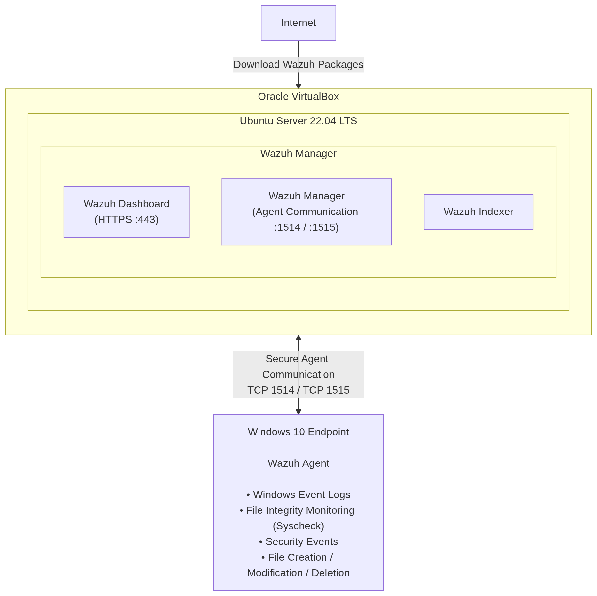
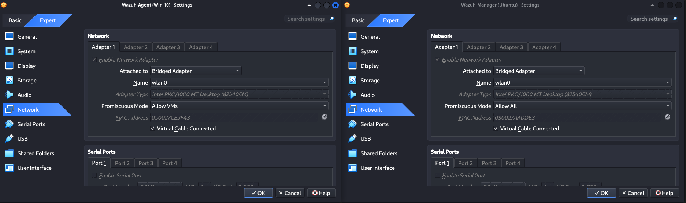
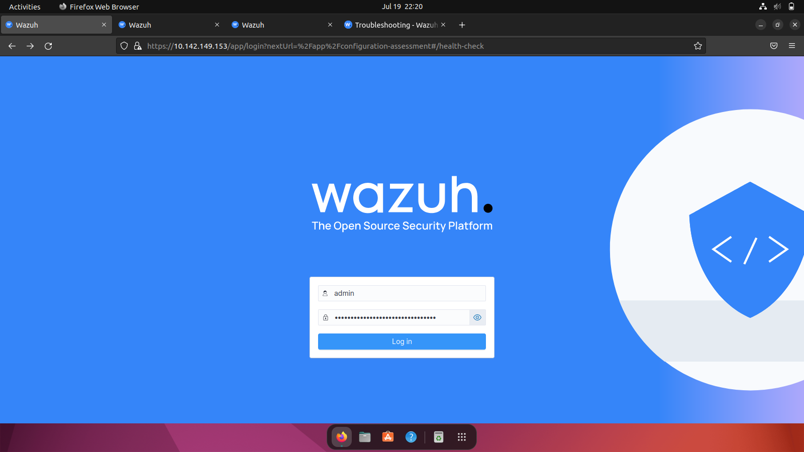
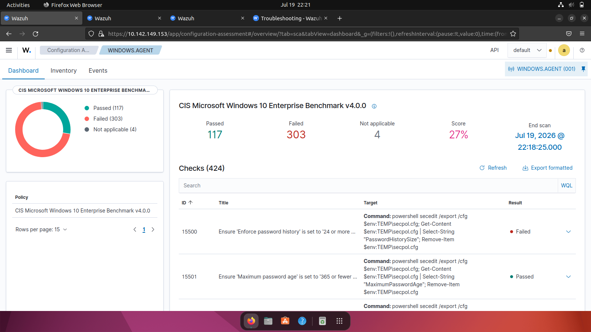
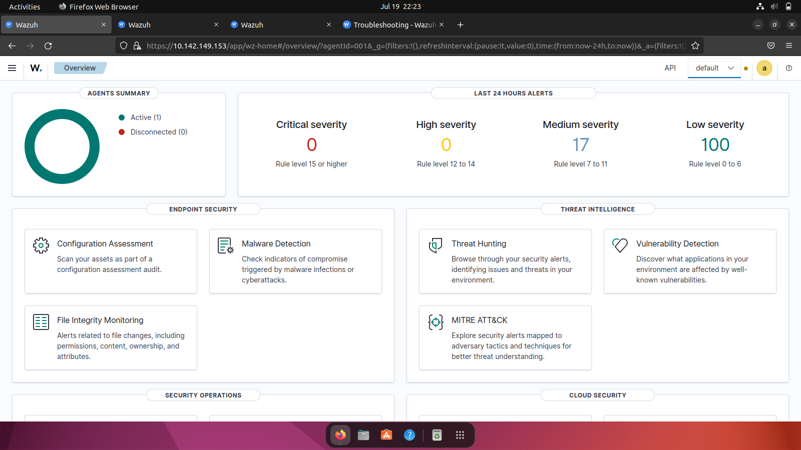
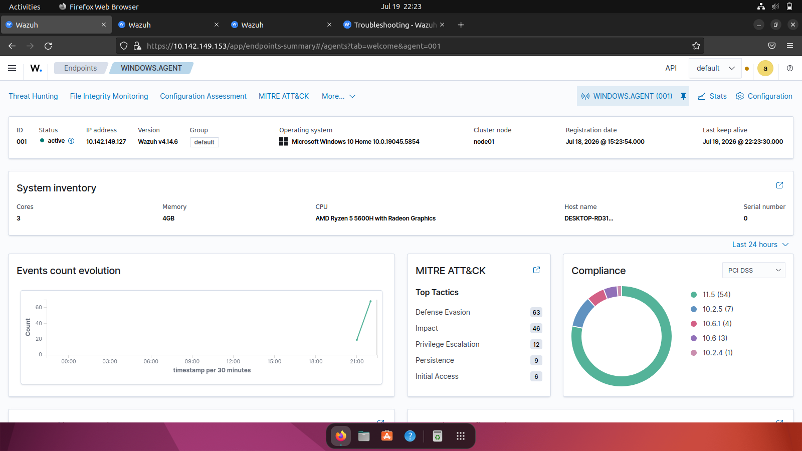
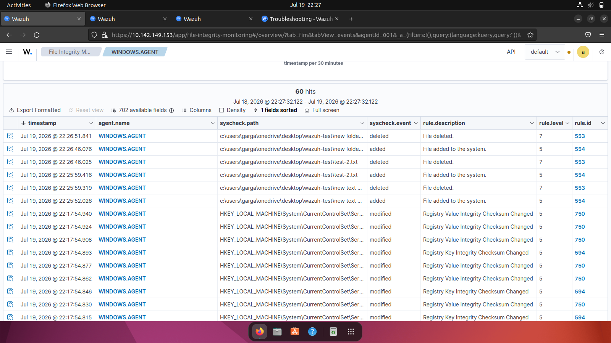
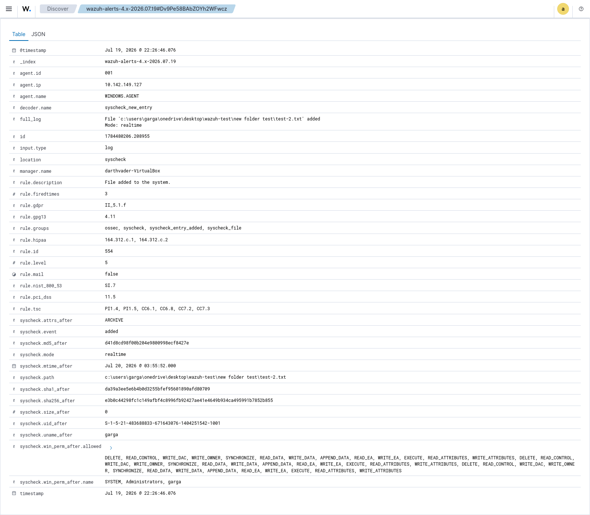
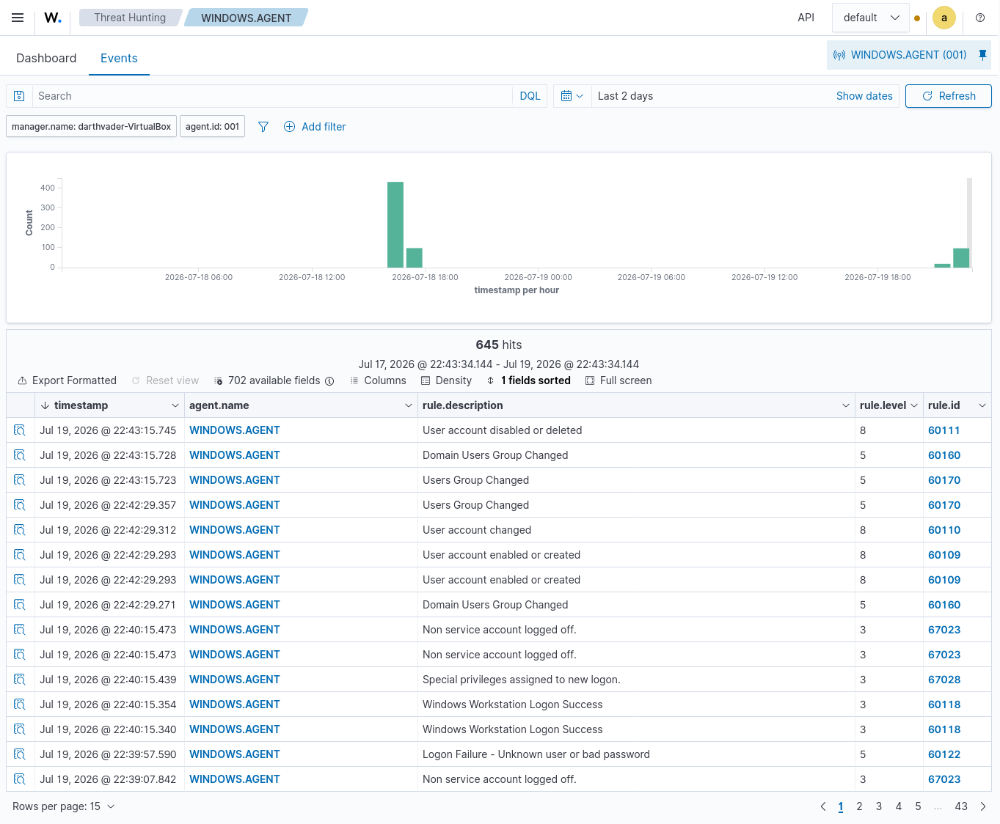

# 🛡️ Wazuh SIEM Home Lab

<p align="center">
  
  
  
  
  <a href="https://opensource.org/licenses/MIT">
    
  </a>
</p>

---

## 📖 Overview

This project demonstrates the deployment of a **Security Information and Event Management (SIEM)** home lab using **Wazuh**.

The environment consists of an **Ubuntu Server 22.04** virtual machine running the **Wazuh Manager** and a **Windows 10** virtual machine configured as a **Wazuh Agent**. The lab provides centralized log collection, endpoint monitoring, File Integrity Monitoring (FIM), and security event visualization through the Wazuh Dashboard.

This project was created to gain practical experience with SIEM deployment and Security Operations Center (SOC) fundamentals.

---

# 🎯 Objectives

- Deploy a Wazuh SIEM environment
- Configure Ubuntu Server as the Wazuh Manager
- Register a Windows endpoint as a monitored agent
- Monitor Windows security events
- Configure File Integrity Monitoring (FIM)
- Investigate security alerts
- Learn the fundamentals of centralized log management

---

# 🏗️ Lab Architecture

<p align="center">
    
</p>

---

# 💻 Lab Environment

| Component | Technology |
|------------|------------|
| SIEM Platform | Wazuh |
| Manager OS | Ubuntu Server 22.04 LTS |
| Endpoint OS | Windows 10 |
| Hypervisor | Oracle VirtualBox |
| Monitoring | File Integrity Monitoring (FIM) |
| Log Source | Windows Event Logs |
| Network | Bridged Adapter |

---

# ❓ Why Wazuh?

Wazuh is an open-source **Security Information and Event Management (SIEM)** and **Extended Detection and Response (XDR)** platform designed to help organizations detect, investigate, and respond to security threats.

Key capabilities include:

- Centralized log collection and analysis
- Real-time threat detection
- File Integrity Monitoring (FIM)
- Vulnerability detection
- Security configuration assessment
- Endpoint monitoring
- Compliance reporting
- Incident investigation and threat hunting

This lab demonstrates how Wazuh can be used to monitor endpoints, collect security events, and investigate alerts within a centralized security monitoring environment.

---

# 📋 Prerequisites

Before deploying this lab, ensure you have the following:

- Oracle VirtualBox
- Ubuntu Server 22.04 LTS ISO
- Windows 10 ISO
- Minimum 8 GB RAM (16 GB recommended)
- At least 60 GB of available disk space
- Internet connectivity for package installation
- Basic knowledge of Linux command-line administration

---

# ⚙️ Installation

Clone the repository:

```bash
git clone [https://github.com/your-username/Wazuh-SIEM-Lab.git](https://github.com/Wolf1904/Wazuh-SIEM-Home-Lab.git)
cd Wazuh-SIEM-Home-Lab
```

Follow the detailed deployment guide available in:

- `docs/installation-notes.md` – Complete installation and deployment steps
- `configs/manager-notes.md` – Wazuh Manager configuration notes
- `configs/ossec.conf` – Sample Wazuh Manager configuration used in this lab

After completing the installation, register the Windows agent with the Wazuh Manager and verify connectivity through the Wazuh Dashboard.

---

# 🚀 Features

- ✅ Wazuh Manager Deployment
- ✅ Wazuh Dashboard
- ✅ Windows Agent Registration
- ✅ Centralized Log Collection
- ✅ File Integrity Monitoring (FIM)
- ✅ Security Alert Visualization
- ✅ Threat Hunting Dashboard

---

# 📂 Repository Structure

```text
Wazuh-SIEM-Lab/
│
├── assets/
│   └── siem-lab-architecture.png
│
├── configs/
│   ├── manager-notes.md
│   └── ossec.conf
│
├── docs/
│   └── installation-notes.md
│
├── screenshots/
│   ├── reports/
│   │   └── wazuh-fim-report.pdf
│   ├── virtualbox-nw.png
│   ├── wazuh-agent-active.png
│   ├── wazuh-alert-details.png
│   ├── wazuh-dashboard.png
│   ├── wazuh-dashboard-1.png
│   ├── wazuh-fim-alert.png
│   ├── wazuh-login.png
│   └── wazuh-threat-hunting.png
│
└── README.md
```

---

# 📸 Screenshots

## Lab Network

VirtualBox networking configuration used for communication between the Wazuh Manager and Windows Agent.



---

## Wazuh Login

Authentication page for the Wazuh Dashboard.



---

## Wazuh Dashboard

Main dashboard showing the status of the SIEM environment.



---

## Dashboard Overview

Overview of monitoring modules and collected security events.



---

## Registered Windows Agent

Windows endpoint successfully connected to the Wazuh Manager.



---

## File Integrity Monitoring Alert

Alert generated after a monitored file was modified.



---

## Alert Details

Detailed information about the detected event.



---

## Threat Hunting Dashboard

Threat hunting interface used to investigate collected events.



---

# 📄 Reports

The repository includes a sample **File Integrity Monitoring (FIM)** report generated by Wazuh.

| Report | Description |
|----------|-------------|
| `screenshots/reports/wazuh-fim-report.pdf` | Sample report demonstrating File Integrity Monitoring alerts and event details. |

---

# 📚 Documentation

| File | Description |
|------|-------------|
| `docs/installation-notes.md` | Step-by-step installation and deployment notes |
| `configs/manager-notes.md` | Configuration notes for the Wazuh Manager |
| `configs/ossec.conf` | Wazuh Manager configuration file used in the lab |

---

# 🛠️ Skills Demonstrated

- Security Information and Event Management (SIEM)
- Security Operations Center (SOC) Fundamentals
- Wazuh Deployment and Configuration
- Linux Administration
- Windows Endpoint Monitoring
- Windows Event Log Collection
- File Integrity Monitoring (FIM)
- Log Analysis
- Threat Hunting
- Incident Investigation
- Virtualization
- Network Configuration

---

# 🚧 Future Improvements

- Add Windows Detection Scenarios
- Integrate Sysmon
- Configure Active Response
- Develop Custom Detection Rules
- Add Linux Agents
- Integrate Threat Intelligence
- Configure Email Alerts
- Simulate Cyber Attacks
- Map detections to the MITRE ATT&CK Framework

---

# 🙏 Acknowledgements

This project was developed as part of my cybersecurity learning journey to gain practical experience with SIEM deployment, endpoint monitoring, and security event analysis using Wazuh.

The initial environment setup was inspired by community learning resources. The lab was independently deployed, validated, documented, and maintained as a hands-on cybersecurity project.

---

# 📜 License

This project is licensed under the **MIT License**.

---

<p align="center">
⭐ If you found this project useful, consider giving it a star!
</p>
